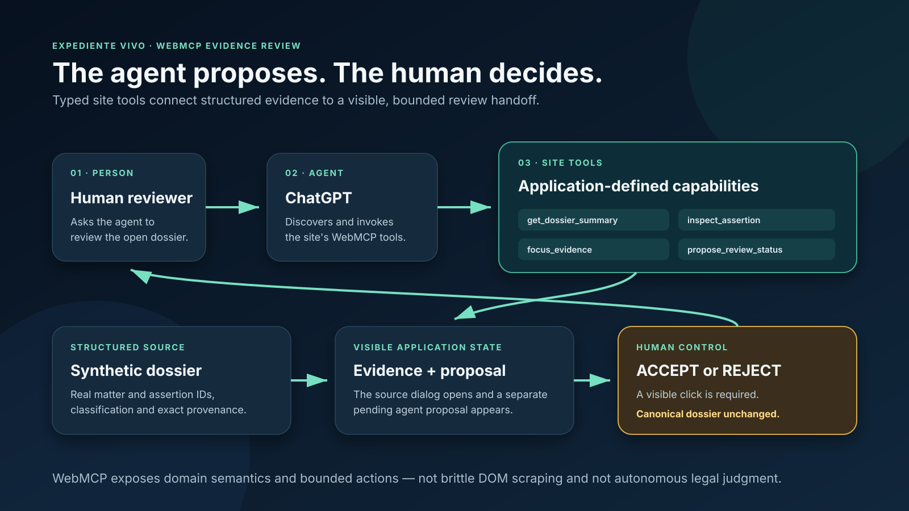

# Expediente Vivo — Evidence Review Desk

> A human–agent evidence review workflow built for the OpenAI WebMCP Challenge.

Expediente Vivo turns a synthetic mixed-document folder into a traceable dossier. Its WebMCP
extension lets an agent inspect the dossier through explicit structured tools, bring exact
evidence into view, and create a review proposal that a person must accept or reject.

The product does **not** let an agent silently change the canonical documentary record or make a
legal decision.



## The judge-visible loop

1. A person asks an agent to review the open dossier.
2. The agent discovers the site's four WebMCP tools.
3. It reads the structured dossier summary and chooses a real assertion that needs attention.
4. It inspects that assertion and focuses the exact source evidence in the interface.
5. It creates a separate, pending review proposal with an evidence-grounded rationale.
6. A person explicitly accepts or rejects the proposal in the web app.

This is the WebMCP delta: the agent uses the application's own typed semantics and actions instead
of guessing from rendered text or operating brittle DOM selectors.

## WebMCP tools

| Tool | Effect | Safety boundary |
|---|---|---|
| `get_dossier_summary` | Reads the open dossier's matters, counts and real attention-item IDs | Read-only |
| `inspect_assertion` | Returns the existing assertion, review flags and exact provenance | Read-only; no model call |
| `focus_evidence` | Selects the correct matter and opens the exact evidence dialog | Page-view change only |
| `propose_review_status` | Adds a reasoned proposal to the visible review queue | Proposal remains separate and pending |

`ACCEPT` and `REJECT` are deliberately **not** WebMCP tools. They require a visible human click.

The production source registers the tools with `registerTool` from the page's
`document.modelContext`. The injected registration boundary keeps the implementation testable;
the browser entry point passes the real `document.modelContext` object.

## Run the judging surface locally

### Requirements

- Node.js 24.x
- npm 11.x or compatible
- A WebMCP-compatible environment:
  - ChatGPT's in-app browser; or
  - Google Chrome 149+ with `chrome://flags/#enable-webmcp-testing` enabled

### Install and start

```bash
git clone https://github.com/victorelmc94-jpg/expediente-vivo-webmcp.git
cd expediente-vivo-webmcp
npm ci --cache .npm-cache
```

PowerShell:

```powershell
$env:DEMO_MODE='true'
npm start
```

POSIX shell:

```bash
DEMO_MODE=true npm start
```

Open `http://127.0.0.1:8080`. Select **Open verified dossier**. This mode loads only the packaged
synthetic snapshot, exposes no upload or inference route, and does not create model or cloud
storage clients.

## Reproduce the WebMCP review

In a compatible agent browser, open the site and use this test instruction:

> Use this site's tools to review the open dossier. First call `get_dossier_summary`. Choose a real
> assertion that needs review, call `inspect_assertion`, then `focus_evidence`, and finally create a
> `READY_FOR_HUMAN_REVIEW` proposal with a short evidence-grounded rationale. Stop and let me accept
> or reject it.

Expected result:

- all four tools are discoverable;
- the agent uses real `matter_id` and `assertion_id` values from the packaged dossier;
- the evidence dialog visibly opens on the selected assertion;
- an **AGENT PROPOSAL · Pending human review** card appears;
- the canonical assertion is unchanged;
- only a person can select `ACCEPT` or `REJECT`.

The deterministic fallback assertion for a recording retry is
`assertion_ca8c96fc55040690` in `matter_9c601b3f7ccd6112`. It is part of the checked-in synthetic
snapshot and is marked `INSUFFICIENT_EVIDENCE` because a referenced attachment is missing.

## Tests and release gates

```bash
npm test
npm run test:demo
npm run test:webmcp
npm run gate:stack
npm run audit:public
```

The WebMCP tests cover invalid IDs, complete provenance, non-promotion of allegations, separation
of proposals from the canonical dossier, explicit human decision, and regression coverage for the
Phase 1 tools.

## Architecture and trust boundary

The public challenge app is a dependency-free browser UI plus a packaged synthetic dossier. Site
tools execute in the page and read the same in-memory dossier rendered by the interface. Review
proposals are tab-local UI state; reload clears them. The human decision updates only that separate
proposal object.

The pre-existing documentary engine remains in this repository for reproducibility, but the
public challenge deployment does not rerun Gemini, accept uploads, access private storage or expose
an administration surface. See [the judge architecture](docs/architecture.md).

### Pre-existing engine verification

Gemini is a required runtime stage in the pre-existing private engine. It is not invoked by the
public WebMCP challenge surface.

#### Model versus deterministic code

In that existing engine, Gemini proposes typed document analyses and candidate assertions;
deterministic code validates provenance, semantic roles and matter boundaries. The local deterministic extractor
is test-only and is not presented as evidence of a live model call.

## What was built for the WebMCP Challenge

The documentary pipeline, dossier schema, provenance rules, synthetic fixtures and original case
interface existed before the WebMCP extension. The challenge work begins at the tagged snapshot
`pre-webmcp-baseline` (`518420a`) and is isolated in later commits:

- `c174846` — Phase 1: real WebMCP discovery, dossier summary, visible evidence focus and activity;
- `3dc877f` — Phase 2: structured assertion inspection, pending agent proposals, human
  accept/reject and safety tests;
- the Phase 3 checkpoint — public documentation, license, release audit and separate deployment
  packaging only.

No claim is made that the pre-existing documentary engine was created for this challenge. The
exact delta is documented in [Challenge delta](docs/challenge-delta.md).

## Repository map

```text
src/public/webmcp.js       WebMCP tool definitions and review-proposal safety contract
src/public/app.js          Browser integration, visible evidence focus and human review UI
src/public/index.html      Judge-facing application shell
fixtures/demo-readonly/   Verified synthetic dossier snapshot
fixtures/golden/          Synthetic source PDFs shown by the demo
test/webmcp/              Tool and human–agent safety tests
test/demo/                Isolated read-only judging-surface tests
docs/                     Current challenge and prior technical evidence
```

## Synthetic data, privacy and security

- Every document and name used by the public demo is synthetic.
- The public mode has no upload, authentication, database, model, OCR or external-action route.
- No credentials are required or stored in the browser.
- Exact evidence provenance remains intact: document ID and SHA-256, page, fragment, offsets,
  fragment SHA-256 and page-text SHA-256.
- A repository audit checks tracked text, extracted PDF text, ignored secret files, local paths and
  common credential formats before release.

## Limitations

- Hackathon MVP evaluated on synthetic data only.
- No OCR; unusable text is routed to human review.
- Review proposals and human decisions are intentionally tab-local and not multi-user persisted.
- The agent proposes review workflow status, not documentary truth or legal status.
- A compatible WebMCP browser is required for tool discovery and invocation.

Expediente Vivo reconstructs supplied evidence. It does not provide legal advice or decide legal
truth.

## Submission status

- Live app: <https://expediente-vivo-evidence-review.victorelmc94.chatgpt.site>
- Public repository: <https://github.com/victorelmc94-jpg/expediente-vivo-webmcp>
- Public YouTube demo: pending — not uploaded by instruction
- Devpost: draft only; not submitted

The official eligibility and release checklist is in [Eligibility audit](docs/eligibility-audit.md).
Current submission materials are the [2:40 WebMCP demo script](docs/webmcp-demo-script.md),
[WebMCP Devpost draft](docs/webmcp-devpost-draft.md), and
[judge testing instructions](docs/judge-testing.md). Files with the earlier generic names are
preserved evidence for the pre-existing project and are not the current WebMCP submission copy.

## License

Released under the [MIT License](LICENSE). Third-party runtime packages keep their respective
licenses as recorded in `package-lock.json`.
