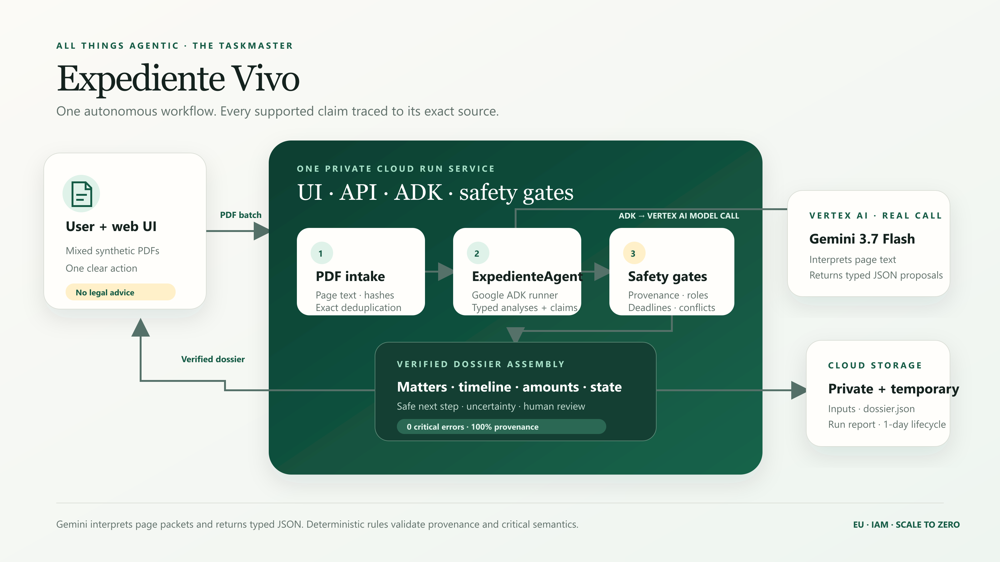

# Devpost submission draft

This is a complete internal working draft. The authorized read-only judging URL is filled in;
repository and video URLs remain intentionally unpublished.

## Project name

**Expediente Vivo**

## Tagline

**From messy PDFs to a living case file—every supported claim traced to its source.**

## Track

**The Taskmaster**

## Short description

Expediente Vivo autonomously reconstructs mixed document folders into separate, actionable case
files. It preserves the difference between facts, allegations and uncertainty, and makes every
supported claim inspectable down to document, page, fragment, offsets and hashes.

## Inspiration and problem

Administrative, financial and legal document folders rarely arrive in chronological order or
belong to only one matter. Contracts, demands, orders, notes, duplicates and unreadable scans get
mixed together. Reconstructing what happened, which amount means what, what remains pending and
which person a deadline applies to is slow, repetitive work with a high cost of subtle mistakes.

A conventional chat summary is not enough. It may sound useful while merging matters, promoting
an allegation into a fact or hiding the absence of evidence. The recurring friction that inspired
this project needed an autonomous workflow whose output could be inspected and challenged.

## What it does

The user supplies a folder of PDFs once. A single `ExpedienteAgent` inventories the files,
extracts text by page, identifies exact duplicates, separates independent matters, proposes typed
assertions, reconstructs timelines and amount ledgers, detects unresolved evidence and produces a
safe next action. The output is a structured `dossier.json` plus a human-readable case view.

The user can select any supported claim and see its document, page, exact fragment, offsets and
SHA-256 hashes. Party allegations stay allegations. Deadlines retain their target party.
Contradictions remain unresolved. Weak or missing text becomes human review rather than invented
content. Proposed actions are never executed automatically.

Expediente Vivo reconstructs supplied evidence; it does not provide legal advice or decide legal
truth.

## How it works

1. A single authenticated Cloud Run service accepts the PDF batch and validates input limits.
2. PDFs are extracted with page boundaries intact; documents are hashed and exact duplicates are
   collapsed.
3. The Google ADK agent sends Gemini 3.7 Flash through Vertex AI canonical document packets with
   document ID, page number, text quality and exact normalized page text. Gemini interprets varied
   prose, identifies document type/date/parties/references and returns schema-constrained document
   analyses plus typed candidate assertions with exact source fragments.
4. Deterministic provenance gates require exact document, page, fragment, offsets and hashes.
   Semantic gates prevent allegation promotion, wrong-party deadlines, matter mixing and false
   certainty.
5. Verified assertions are assembled into separate dossiers with timeline, amounts, state,
   uncertainty and a proposed next step.
6. Inputs and run artifacts are stored temporarily in a private Cloud Storage bucket. The same
   Cloud Run service renders the traceable result.

The key design rule is: **Gemini proposes; deterministic rules validate.**

Gemini is central to the product rather than an ornamental API call: the downstream matter,
timeline, amount and state reconstruction consumes its typed analyses and candidate assertions.
The deterministic layer does not interpret the source prose; it decides which model proposals are
valid and safe to expose.

## Why this is agentic

This is not a chat interface around a single prompt. From one high-level user instruction, the
agent carries out a multi-step document operation: inventory, page extraction, deduplication,
classification, matter separation, structured generation, provenance validation, semantic safety
checks, dossier assembly and artifact persistence. It decides how proposed evidence fits the
workflow, while code-enforced gates decide what is safe to expose as supported.

The final product is a reusable data structure and action-oriented report, not a conversation.

## Built with

- Google Agent Development Kit (`@google/adk` 2.0.0)
- Gemini 3.7 Flash through Vertex AI
- Google Gen AI SDK (`@google/genai`)
- Google Cloud Run, one authenticated service
- Google Cloud Storage, private temporary artifacts
- Cloud Build and Artifact Registry
- Node.js 24 and JavaScript ES modules
- `pdfjs-dist` for page-preserving PDF extraction
- Dependency-free HTML, CSS and browser JavaScript for the product view

## Mandatory Google stack proof

| Requirement | Implementation | Proof |
|---|---|---|
| Gemini 3.5+ | Gemini 3.7 Flash | Deployed run report records the model plus non-zero ADK input/output usage |
| Google Agent Framework | Google ADK 2.0.0, one `ExpedienteAgent` | `LlmAgent` + `InMemoryRunner.runEphemeral`, `extractor_mode=vertex-adk` |
| Google Cloud infrastructure | Cloud Run and private Cloud Storage | Same run ID in Cloud Logging, the UI result and private GCS artifacts |
| Vertex AI model access | ADK `Gemini` adapter with `vertexai: true`, location `eu` | Runtime identity has `roles/aiplatform.user`; three remote runs captured 2,741 input and 4,905 output tokens each |

The final video will show a fresh, continuous authenticated Cloud Run execution. It will then
correlate that run ID with `vertical_slice_completed` in Cloud Logging and the same GCS
`run_report.json`, where `model=gemini-3.7-flash`, the ADK extraction stage and non-zero model
usage are visible. The separate judging page loads a verified precomputed synthetic dossier, says
so on screen and never presents itself as that live execution.

## Architecture

The model is bounded by deterministic provenance and semantic gates inside the same Cloud Run
service. Runtime identity has only Vertex AI access and object creation in the private bucket.
Cloud Run scales from zero to one instance for the validation deployment.

## Data and evaluation

All development, evaluation and demonstration data is synthetic.

The primary set contains ten PDFs across two matters, an exact duplicate and a page without usable
text. An independently written second set contains eleven PDFs with different wording and formats,
cross-references, multi-page documents, a renamed duplicate, contradictory evidence, a claim that
must not become fact, a deadline for another party, an ambiguous date, degraded text and
insufficient evidence. Its ground truth was defined before model execution.

Results:

- local safety and vertical-slice suite: 19/19 PASS;
- direct Vertex AI plus private Cloud Storage: 5/5 stable runs;
- private Cloud Run primary evaluation: 3/3 runs and 13/13 adversarial checks PASS;
- independent robustness evaluation: 3/3 runs and 15/15 checks PASS;
- zero critical errors and 100% complete provenance for supported assertions.

## Security and privacy

The evaluated live service remains authenticated and private. Storage uses uniform bucket-level access,
public-access prevention and a one-day lifecycle. The container has no embedded credentials and
runs as an unprivileged user. Inputs are bounded by file count, size, pages, extension and PDF
magic bytes. No real personal data is included.

The judging surface is a separate Cloud Run service configured with `DEMO_MODE=true`. It has no
upload or inference route, creates no ADK/Vertex/Cloud Storage client, receives no Vertex or bucket
permissions and can read only the packaged verified snapshot and its ten allowlisted synthetic
PDFs. `npm audit --omit=dev` reports 21 moderate, zero high and zero critical production
findings. They propagate from two advisories confined to ADK/Cloud Storage branches that this process does not
import; the reachability review and residual risk are documented in the repository.

## Challenges and learnings

The difficult part was not generating a summary; it was creating a reliable boundary between a
model proposal and a supported assertion. Exact-source verification exposed subtle engineering
problems around offsets, page text normalization, duplicates and references that cross documents.
It also showed why assertion type belongs in the product interface: users need to see when a value
is merely claimed, when evidence conflicts and when the system does not know.

An independent synthetic dataset was essential. It prevented a visually convincing golden path
from being mistaken for general reliability and forced degraded text to fail safely.

## Limitations

- Hackathon MVP tested on two synthetic datasets, not production client documents.
- No OCR service; unreliable text is escalated to human review.
- Exact byte duplicates only, not near-duplicates.
- No external action execution and no legal advice.
- Application-level end-user authentication is not implemented. Cloud Run IAM protects the live
  pipeline; the judging URL is limited to precomputed synthetic read-only content.
- Validated runtime for eleven PDFs is approximately 35 seconds.

## Third-party and prior-work disclosure

All product code, deterministic rules, tests, synthetic datasets and submission materials were
created for this project beginning August 25, 2026. Third-party runtime libraries are Google ADK,
Google Gen AI SDK, Google Cloud Storage client and `pdfjs-dist`, declared and locked in the
repository. `adm-zip` is a transitive ADK dependency pinned through an npm override. ReportLab was
used only to generate synthetic development PDFs and is not in the deployed runtime. Google Cloud
SDK, Cloud Build and Artifact Registry support deployment. OpenAI Codex assisted implementation,
review and documentation. No proprietary dataset, pre-existing product backend or copied
application template is used.

Gemini 3.7 Flash is a central runtime component invoked through Vertex AI by Google ADK. It
performs semantic document interpretation and structured proposal generation. The deterministic
local extractor is used only for reproducible contract tests and is not the proof execution.

## Links — internal draft, not submitted

- **Try it:** https://expediente-vivo-judging-demo-t652hf57ja-ew.a.run.app/
- **Source:** https://github.com/victorelmc94-jpg/expediente-vivo
- **Demo video:** https://youtu.be/ToSr4nLRPmY
- **Architecture diagram:** `docs/assets/architecture.png`

If the repository remains private, grant access to the official testing identities specified in
the hackathon rules before final submission.
