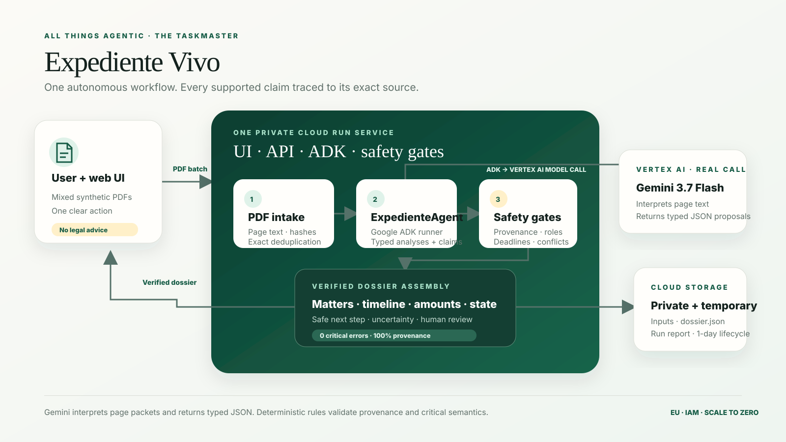

# Architecture

Expediente Vivo is deliberately a small system with a strict trust boundary. One authenticated
Cloud Run service contains the UI, API, the single Google ADK agent and the deterministic safety
gates. There is no second orchestration service and no external action executor.

## Runtime flow

1. The user sends a synthetic batch of PDFs to the Cloud Run service.
2. The service validates the upload, extracts text while retaining page boundaries, hashes every
   document and removes exact duplicates.
3. `ExpedienteAgent`, implemented with Google ADK, sends Gemini 3.7 Flash through Vertex AI the
   canonical document/page packets: document ID, page number, text quality and exact normalized
   page text. Gemini semantically interprets the prose and returns typed document analyses,
   references, parties and candidate assertions under the enforced output schema.
4. Deterministic code verifies that model output. A supported assertion survives only if its
   document, page, exact fragment, character offsets and SHA-256 hashes all match the extracted
   source. Separate semantic gates protect allegation status, deadline targets, matter boundaries
   and unresolved contradictions.
5. The service assembles the verified `dossier.json`, persists temporary run artifacts to private
   Cloud Storage and renders the dossier in the same Cloud Run service.
6. The user can select a claim to inspect its source trace. Proposed actions are never executed.

The model proposes; deterministic rules decide whether a proposal is safe to present.

This boundary is enforced in code: `src/agent/expediente-agent.js` owns the Google ADK → Gemini
structured call, while `src/provenance/validate.js` and `src/matters/reconstruct.js` own the gates.
The correlated cloud evidence and exact video proof are documented in
[`gemini-stack-compliance.md`](gemini-stack-compliance.md).

## Deployment boundary

- Region: `europe-west1`; Vertex location: `eu`; bucket location: `EU`.
- Cloud Run: authenticated, `min=0`, `max=1`, one runtime service account.
- Runtime IAM: Vertex AI use plus object creation in the single private bucket.
- Cloud Storage: uniform bucket-level access, public-access prevention and a one-day lifecycle.
- Secrets: none in source, image or versioned environment files; Google service identity supplies
  runtime credentials.
- Data: synthetic only in development, evaluation and the planned judge demonstration.

## Trust contract

The visible assertion classes are `DOCUMENT_FACT`, `PARTY_ALLEGATION`, `AGENT_INFERENCE`,
`UNRESOLVED`, `PROPOSED_ACTION` and `NEEDS_HUMAN_REVIEW`. A claim is not considered supported
unless deterministic provenance validation succeeds. Missing or degraded evidence reduces
certainty and routes the item to review; it never licenses generation of replacement content.
